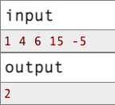
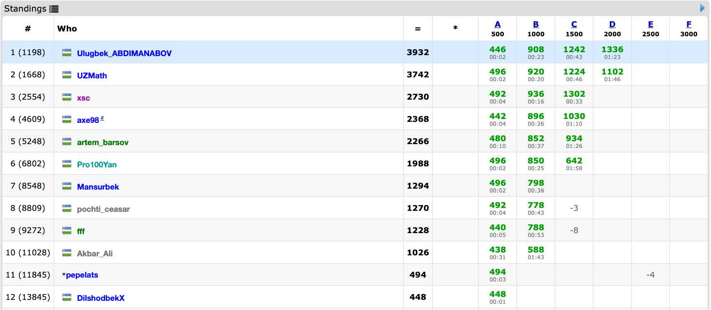

<!-- Guidening birinchi qismi -->

# Sport Dasturlashi va Musobaqalari

Competitive Programming (Sport dasturlashi) – bu shunchaki kod yozib boshqotirma yechish emas. Bu – qanday fikrlashni, muammoga qanday yondashishni va yechimni ishlaydigan dasturga aylantirishni o‘rgatadigan aqliy mashg'ulotdir. Maqola davomida umumiylik uchun inglizcha qisqartmasi *CP* deb yuritiladi.

Ko‘pchilik sport dasturlashi haqida birinchi marta olimpiadalar, onlayn musobaqalar yoki do‘stlari orqali eshitadi. Ammo, CPni to‘liq tushunish uchun uni mashaqqatli, lekin maroqli yo'l sifatida ko‘rish kerak.

Ushbu maqola CP yo‘l xaritasining birinchi bosqichi bo‘lib, sizni o'z olamiga olib kiradi.

## Competitive Programming

CP – bu aniq belgilangan masalalarni vaqt va xotira chegaralari ostida algoritmlar va dasturlash orqali yechish amaliyoti.  

Jarayon odatda quyidagicha bo‘ladi:

1. *Masalani tushunish*.
2. *Samarali algoritm (yechim) ishlab chiqish*.
3. *Algoritmni kod ko'rinihsida ifodalash yozish*.
4. *Ishlash tezligi va xotira chegaralarini tekshirish, va optimizatsiya qilish*.

Masalan:
*Berilgan sonlar ichida nechta juftlik yig‘indisi 10 ga teng?*

Oddiy ko‘rinadi, lekin millionlab sonlar bo‘lsa, sodda yechim ishlamaydi. Ana shunda CP samarali fikrlashni, va tezkor dasturlar yozish mantig'ini o‘rgatadi.

## Nega odamlar CP bilan shug‘ullanadi?

- **Aqlni charxlash** – CP miyyangiz uchun sport zaliga borishga o‘xshaydi.  
- **Olimpiadalar va e’tirof** – IOI, ICPC kabi musobaqalar aqlli insonlar bilan tanishish, karyera imkoniyatlari va katta pullik sovrinlarga eshik ochadi.  
- **Karyera** – yirik IT kompaniyalarga ishga kirishda, masala yechish turida bir nechta suhbatlar o'tkaziladi va 90% holatda CP dagi savollar beriladi.
- **His-tuyg‘ular** – vaqt tugayapti, kod xato bermoqda, oxirgi daqiqada yechim topasiz – bu sportdagi kabi adrenalinni beradi. So'z bilan ifodalash qiyin, buni faqat his qilish kerak!

## Dasturlash Musobaqalari

CP musobaqasi – bu belgilangan vaqt ichida masalalarni yechish bellashuvi. Musobaqa onlayn yoki oflayn tarzda o‘tkaziladi. Shuningdek, individual yoki jamoaviy ko'rinishda ham bo'ladi. 

**Mashxur musobaqalar:**
- Milliy fan olimpiadalar: bir necha bosqichdan iborat bo'ladi va ohirgi bosqich odatda respublika bosqichi hisoblanadi.
- ICPC: universitet talabalari uchun, 3 kishilik jamoalar kuch bellashadi.
- Onlayn musobaqalar: Codeforces, AtCoder, LeetCode kabi platformatlarda muntazam ravishda olib boriladi. Odatda contest deb yuritiladi.  

**Qoidalari:**
- Dastur ma’lum tillarda yozilishi kerak. Masalan, C++, Python, Java, va h.k.  
- Yechimlar avtomatik testlar bilan tekshiriladi.
- Vaqt va xotira chegaralariga javob bermagan yechim to'g'ri bo'lsa ham hisobga olinmaydi.

## CP dagi imkoniyatlar va *xavflar*

CP – bu shunchaki o‘yin emas. Uning xavflari ham, imkoniyatlari ham bor:

- *Vaqt bosimi* – birgina xato uchun soatlar ketishi mumkin. Bosim ostida ishlashga o'rganasiz.
- *Raqobat* – minglab odamlar siz bilan bellashadi. O'sish _damlamasi_ uchun eng kerakli _giyoh_.
- *Kelajak imkoniyatlari* – medallar, stipendiyalar, ish o‘rinlari va doim yangi **sifatli** tanishlar.
- ~~Ruhiy zo‘riqish~~ – ba’zida juda charchatadi. Kutilgan natijani qo'lga kirita olmaslik tushkunliklarga sababchi bo'ladi.

## Aniq Maqsad Qo‘yish

Shug'ullanish jarayonida maqsadni aniq qo‘yish va uni yangilab borish kerak. Maqsadsiz yo‘l chalkash bo‘ladi. Ular asosan quyidagicha bo‘lishi mumkin:

- **Boshlovchi** – sikl, massiv, oddiy masalalarni o‘rganish.  
- **O‘rta daraja** – klassik algoritmlar: saralash, qidiruv, graf asoslari, DP.  
- **Yuqori daraja** – qiyin darajadagi masalalarni ko'p ishlash, xalqaro musobaqalarda qatnashish, medallar yutish.

Shu bilan birga bir maqsadni taklif qilgan bo'lar edim: ZAVQ OLISH. CP bu shunchaki masala yechish emas. Bu olamga sho'ng'igan inson zavq olmay qolmaydi. Qanchalik qiziqish bilan o'rgansangiz, maqsadlarga yetishish shunchalik yoqimli bo'ladi!