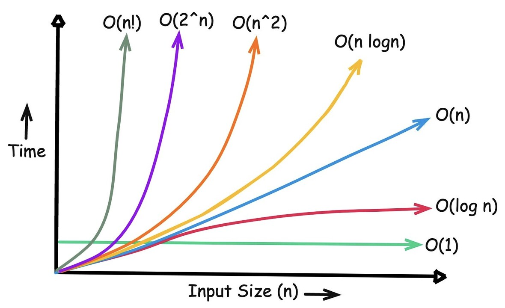

# Algoritmlar va Ma’lumot Tuzilmalari

Endi siz CP olamiga kirish eshigini ochdingiz. Birinchi bosqichda CP nima ekanini bilib, maqsadni belgiladingiz. Ikkinchisida esa til, muhit va platformalarni tayyorladingiz. 

Hozirgi qadam algoritmlar va ma’lumot tuzilmalarining dunyosiga sayohat bo'ladi. Bu ikki tushuncha dasturlashdagi eng ko‘p eshitiladigan, eng ko‘p qo‘rquv uyg‘otadigan va eng ko‘p natija beradigan so‘zlardir. Ularni o‘rganish bu kod yozishni emas, balki fikrlashni o‘rganish demakdir. 

Tasavvur qiling, sizda 100 mingta son bor. Eng kichigini topish kerak. Oddiy. Endi bu masala har soniyada qayta bajarilishi kerak. Endi esa sonlar o‘zgarib turadi, har lahzada. Shu paytda siz algoritm va ma’lumot tuzilmasi nima ekanini sezishni boshlaysiz.

---

## 1. Algoritm — bu kod emas, balki fikrlash natijasidir

Ko‘pchilik algoritmni kod yozish deb o‘ylaydi. Bu xato. Algoritm bu - fikrni tartibga solishdir.  

Masalan, sizda 10 ta son bor, eng kattasini topish kerak. Siz quyidagicha o‘ylaysiz:
1. Dastlabki sonni eng katta deb olasiz.
2. Qolganlarini tekshiring.
3. Kattaroq son topilsa, javobingizni yangilaysiz.
4. Oxirida natijani chiqarasiz.

Siz hozir algoritm yozdingiz, hatto kodsiz. Kod faqat shu fikrni shakllantirish va kompyuterga tushunarli ko'rinishga olib kelish vositasi xolos. Algoritm esa sizning mantig'ingiz va fikrlarningizning to'g'ri ketma-ketligidir.

---

## 2. Nega algoritmlar muhim?

CPda vaqt sizning yagona dushmaningiz. Har bir algoritm bu - jangdagi yordamchingiz, qurolingiz! 

Uning to'g'ri va effektiv ishlata olish, yakuniy natijangiz bilan to'g'ri proporsionaldir. To‘g‘ri tanlangan algoritm sizni g‘alabaga olib boradi. Noto‘g‘ri tanlov esa “Time Limit Exceeded” (keyinroq chuqurroq ko'rib chiqamiz) bilan yakunlanadi.

Tasavvur qiling, sizda bir million son bor. Eng kichigini topish kerak, bu faqat O(n) yondashuv bilan mumkin, chunki aniq javob berish uchun siz har bir elementni bir marta ko‘rib chiqishingiz kerak. Bu eng yaxshi yechim, lekin hamma masalalar bunday oddiy emas. Ba’zan bir xil natijani O(NlogN) yoki hatto O(1) da olish mumkin bo‘lgan holatlar ham bo‘ladi.

Masalan, sizdan berilgan massivda ma’lum bir qiymat bor-yo‘qligini topish so‘raladi. Agar massiv tartiblanmagan bo‘lsa, har bir elementni tekshirishingiz kerak, bu O(N). Ammo agar u allaqachon saralangan bo‘lsa, siz binary search orqali javobni atigi O(logN) da topasiz.

Shuning uchun CPda muhim narsa faqat “yechim topish” emas, balki TEZ va TO'G'RI yechimni aniqlash san’atidir. Musobaqalarda g‘oliblar kodni chiroyli yozgani uchun emas, balki to‘g‘ri algoritm tanlagani uchun yutadi!

---

## 3. Samaradorlik: vaqt va xotira o'rtasidagi muvozanat

Har bir algoritmni ikki mezon bo‘yicha baholash mumkin: 
1. Qanchalik tez ishlashi (vaqt murakkabligi, yoki time complexity)
2. Qanchalik ko‘p xotira olishi (xotira murakkabligi, yoki space complexity)

### Misollar:
| Vazifa | Yondashuv | Murakkablik |
|--------|------------|--------------|
| Har bir elementni tekshirish | Oddiy sikl | `O(N)` |
| Tartiblangan massivda qidirish | Binar qidiruv | `O(logN)` |
| Har bir juftlikni solishtirish | Ichma-ich sikl | `O(N^2)` |
| Har bir juftlikni HashSet orqali tekshirish | Hash | `O(N)` |

Har bir murakkablik sizning vaqtni qanday boshqarayotganingizni bildiradi. Har safar yechim yozganingizda, o‘zingizdan so‘rang: bu `O(N)`mi, `O(NlogN)`mi, yoki undan ham sekinmi?

---

## 4. Ma’lumot tuzilmalarining kuchi

Algoritm bu - qanday qilish. Ma’lumot tuzilmasi esa - nimaga qilish. Agar ma’lumotlar tanlangan ma'lumotlar tuzilmasiga nisbatan noto‘g‘ri joylashgan bo‘lsa, hatto eng mukammal algoritm ham sekin ishlaydi.

Tasavvur qiling, sizda 100 ming ism bor. Agar ular alfavit bo‘yicha saralangan bo‘lsa, kerakli ismni tez topasiz. Agar aralash bo‘lsa, har safar hammasini tekshirishingiz kerak bo‘ladi. Mana shu farq array va set o‘rtasidagi farqdir.  

### Asosiy tuzilmalar:
| Tuzilma | Maqsad | Xususiyat |
|----------|--------|------------|
| Array / Vector | Elementlar ketma-ket joylashadi | Oddiy, lekin qidirish sekin |
| Stack / Queue | Ohirgi yoki birinchi element bilan ishlaydi | Masalan, `undo`, BFS |
| Set / Map | Noyob elementlar va kalit-qiymat juftliklari | Tez qidirish imkonini beradi |
| Graph / Tree | Murakkab tuzilmalarni ifodalay oladi | Yo‘llar, tarmoqlar uchun mos |

CPda “nima ishlaydi” degan savol emas, “qaysi tuzilma bu joyda samaraliroq” degan savol muhim.

---

## 5. Algoritmni o‘rganishning san’ati

Ko‘pchilik yangi algoritmni yodlab olmoqchi bo‘ladi. Bu foydasiz. Yodlash emas, tushunish kerak.

Har bir algoritmni o‘rganayotganda uchta savol bering:
1. Nima qiladi?
2. Qanday ishlaydi?
3. Qachon ishlatish kerak?

Agar shu uchta savolga javob bera olsangiz, siz uni yodlamaysiz, balki u sizning fikrlashingizga singadi va uni ishonch bilan ishlata olasiz.

> “Algoritmni o‘rganish bu - kod yozishni emas, fikrni tartibga solishni o‘rganishdir.”

---

## 6. Qayerdan boshlash kerak

Endi sizga kerak bo‘ladigani yo‘nalish va tartib.

### Boshlovchilar uchun:
1. Asosiy algoritmlar: saralash (sort), qidiruv (search), hisoblash (prefix sum)  
2. Asosiy tuzilmalar: array, vector, stack, queue, map, set  
3. Asosiy tushunchalar: vaqt va xotira murakkabligi, rekursiya, greedy yondashuv  

### Tavsiya etiladigan manbalar:
- [CP-Algorithms](https://cp-algorithms.com) — C++ misollar bilan
- [CSES Problem Set](https://cses.fi/problemset/) — mashq uchun
- YouTube: William Lin, Errichto
- Kitoblar: Introduction to Algorithms (CLRS), CP Guide

---

## 7. Mashq qilish — yagona yo‘l

Algoritmni o‘qish birinchi qadam qo'yishdek, lekin o‘rganish uni amalda ishlatish haqiqiy journey hisoblanadi. Har kuni kamida bitta masala yeching. Yechimlaringizni tahlil qiling, boshqalar bilan taqqoslang. Ularning yechimi siznikidan tezroq bo‘lsa, nega shundayligini tushunishga harakat qiling. Ishlayotgan masalalaringizni qiyinchiligini (difficulty) oshirib boring.

Bu jarayon sekin, ammo haqiqiy CP tafakkurini aynan shu shakllantiradi. Bir kun kelib siz masalani ko‘rib, “buni segment tree bilan yechish kerak,” deb o‘ylaysiz va shu paytda siz yangi darajaga o‘tgan hisoblanasiz.

---

Algoritmlar va ma’lumot tuzilmalarini o‘rganish CPning yuragi. Ular sizni tez, aniq va strategik fikrlashga o‘rgatadi. Yangi mavzudan qo‘rqmang, uni qiziqish bilan o‘qing, va har bir masalani o‘sish uchun imkoniyat sifatida qabul qiling.  

Har bir yechim kichik g‘alaba. Har bir xato esa keyingi g‘alabaning asosi.  