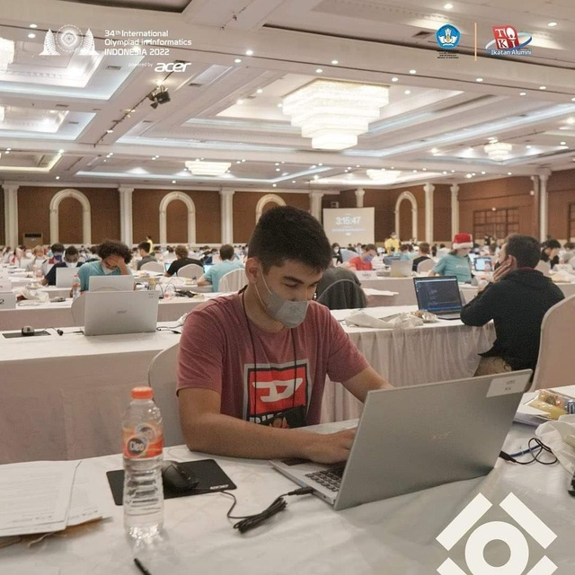

<!-- Guidening to'rtinchi qismi -->

# CP Jamiyati va Musobaqalar

Siz endi CP uchun kerakli asosiy narsalarni, ya'ni til, muhit, algoritm va tuzilmalarni nimaligini bilib oldingiz. Keyingi qadam bu yo'lda o‘zingizni yolg‘iz his qilmaslik bo'lishi kerak. Hamma mashxur dasturchilar ham o'zining o‘rganish jarayonida boshqalarga tayanib, yordam olib bosib o‘tgan. CP dunyosida bu ayniqsa muhim. Chunki CPda jamiyat, raqobat va do‘stlik sizni maqsad qadar yo'lingizni tezlashtiradi.

## Nega birga o‘rganish muhim?

Tez bormoqchi bo'lsang yolg'iz, uzoqqa bormoqchi bo'lsang birga yur, degan aqlli gap bor. Lekin, CPda buning teskarisi ishlaydi. Yolg‘iz o‘rganish intizom beradi, lekin uzoqqa yetkazmaydi. CPning tabiati bu - doimiy harakat, yangilik va musobaqa. Agar siz yolg‘iz ishlasangiz, qaysidir joyga kelib toliqasiz, yoqmay qoladi, yoki shunchaki umidsizlikka tushib qolasiz. Jamiyat esa sizga “yordam so‘rash”ni, “boshqalardan o‘rganish”ni va eng muhimi *o‘zingizni solishtirishni* o‘rgatadi. Solishtirish bu siz boshqalardan o'tib ketishga ko'rolmaslik orqali harakat qilish emas, balki, o'zingizdan kuchliroq insonlarga qarab, ular bosib o'tgan yo'lni o'zingiznikiga solishtirib analiz qilib borish imkonidir. Bu orqali siz yo'l qo'yayotgan xatoliklaringizni tuzatib borasiz.

MUHIM!!!
> Sizdan kuchliroq insonni ko‘rsangiz, bu sizni ruhan sindirmasligi kerak. Aksincha, bu yo‘lning borligini, va siz ham shu yo‘ldan o‘ta olishingizni ko‘rsatadi. Ular bilan tanishing, do'st bo'ling. To'g'ri mindset yarating va hatto eng asosiy raqobatdoshlaringiz bilan ham do'st tutining. Shundagina siz bu jarayonda zavqlanasiz.

## Onlayn jamiyatlar

Bugun CPni o‘rganish uchun sizga yetarlicha kuchli jamiyatlar mavjud. Eng faol va foydali joylardan boshlang.  

### Tavsiya etiladigan joylar:
- *Telegram*: CPga bag‘ishlangan mahalliy guruhlar (masalan, @cp_uz kanali va boshqa guruhlar).
- *Discord*: xalqaro CP serverlari, masalan, *Codeforces Community* yoki *AtCoder Discord*.
- *Codeforces Bloglari*: bu yerda yechimlar, tahlillar va yangi musobaqalar haqida jonli muhokamalar bo‘ladi.

Bu joylarda har kuni kimdir savol beradi, kimdir yechim bilan javob qaytaradi. Har bir muhokama siz uchun yangi narsa. Shunchaki tomoshabin bo‘lmang — javob yozing, fikr bildiring, o‘zingizni eshittiring. Shunda siz CP jamiyatining haqiqiy a’zosi bo‘lasiz.

## Musobaqalar

Musobaqa bu - CPdagi eng kuchli o‘qituvchi. Bu yerda siz vaqt bilan kurashasiz, stress ostida fikrlaysiz va kodni vaqt bosimi ostida yozasiz. Boshqa hech bir mashq bu tajribani bera olmaydi.

Boshlanish uchun kichik bosqichlardan o‘ting:
1. *AtCoder Beginner Contest (ABC)* – haftalik, qulay va osonroq kirish nuqtasi.
2. *Codeforces Div.4 yoki Div.3* – biroz murakkabroq, lekin o‘sishga majbur qiladi.
3. *CSES Problem Set* – musobaqa bo‘lmasa-da, tayyorlov uchun juda yaxshi manbaa.

Musobaqada muvaffaqiyat faqat natija emas. Har safar qatnashganingizda siz o‘z miyya reflekslarini kuchaytirasiz: masalani tez o‘qish, muhim narsani ajratish, vaqtni taqsimlash.

## Xatolardan o‘rganing

Ko‘pchilik musobaqadan keyin natijaga qarab to‘xtaydi. Bu eng katta xato. Ingliz tilida bir ajoyib gap bor: "Every expert was once a beginner". Musobaqaning eng qimmat qismi u tugagandan keyin boshlanadi.

Tahlil qilish uchun o‘zingizga vaqt bering va quyidagi qadamlarni bajaring:
- Har bir masala yechimiga qarang, editorialni o‘qing.
- Nima uchun sizning yondashuvingiz ishlamadi? Mantiq xatomi yoki vaqt murakkabligimi?
- Boshqalar kodini tahlil qiling. Ba’zan 10 qatordan iborat yechimni tushunishga bir necha soat ketishi mumkin, lekin, chekinmang.

Tahlil bu - CP tafakkurining ildizi. Siz shunchaki yechimlarni to‘plamayapsiz, siz o‘rganish mexanizmini shakllantirayapsiz. Qanchalik ko'p masalalarga to'g'ri yechimlarni o'rgansangiz, shunchalik yangi masalalarga to'g'ri yondashuv topish osonlashadi.

## Jamoaviy musobaqalar va do‘stona raqobat

Bir kun kelib siz jamoaviy musobaqalarda qatnashasiz, masalan, **ICPC** yoki mahalliy universitet turnirlari. Bu tajriba CPni butunlay boshqa tomondan sizga ko'rsatadi.

Jamoa odatda uch kishidan tashkil topadi. Taklif qilinadigan jamoa tarkibi quyidagicha: kuchli matematik, kod yozishda va fikrni kodga o'girishda tez inson va uchinchisi tahlil+debuggingda kuchli, kritik fikrlay oladigan a'zo. Sizlar bir-biringizni to‘ldirasiz.

Do‘stona raqobat ham shunday ishlaydi. O‘zingizga “rival” toping — sizdan biroz kuchliroq odam. U sizni yutadi, siz javoban ko‘proq mashq qilasiz. Shu jarayon sizni harakatda ushlab turadi.

---

CP jamiyati bu raqobat va hamkorlik aralashgan katta oila. Unda hech kim mukammal emas, lekin hamma o‘sishda davom etadi. Birgalikda o‘rganish, bahslashish, tahlil qilish — bularning barchasi sizni nafaqat kuchli dasturchiga, balki kuchli fikrlovchi insonga aylantiradi.