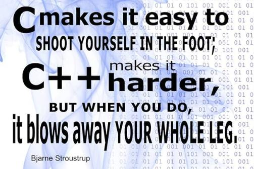

<!-- Guidening ikkinchi qismi -->

# Dasturlash Tillari va Platformalar

CPni boshlash uchun sizga faqat “dasturlashni bilish” kifoya emas. Sizga qulay muhit, to‘g‘ri til va to‘g‘ri platformalar kerak bo‘ladi. Ko‘p boshlovchilar bu bosqichni e’tiborsiz qoldiradi va natijada ular noto‘g‘ri manbaalardan foydalanishadi, to‘g‘ri muhitni o‘rnatolmaydi, yoki qayerdan boshlashni bilmaydi.  

Bu maqolada siz shularning barchasini o‘rganasiz:
- qaysi dasturlash tili CP uchun eng mos
- qanday muhit kerak
- masalalar qayerda yechiladi
- va qanday qilib o‘rganishni to'g'ri yo‘lga qo‘yish kerak

## Dasturlash tilini tanlash

CPda eng muhim qarorlardan biri bu - til tanlovi.

### Eng keng tarqalgan tillar:
- **C++** – tezligi, qulay kutubxonalari (STL) va boshqa tillar bilan raqobatdagi ustunligi uchun tanilgan.  
- **Python** – oson sintaksis, yangi boshlovchilar uchun qulay, ammo ba’zida sekin.
- **Java** – ko'p imkoniyatli, lekin sintaksisi uzun va ba’zi platformalarda unchalik mashhur emas.

> Biz sizga C++ ni maslahat beramiz!

### Nega C++?
- Har bir milliy va xalqaro musobaqada qo‘llaniladi.
- Eng ko‘p misollar, yechimlar va tayyor kodlar aynan C++da yozilgan.
- STL (Standard Template Library) juda katta ustunlik beradi.
- Tezlik va qulaylik balansi sabab CP uchun boshqa tillardan ancha ustun.

Shunday qilib, agar siz yangi boshlayotgan bo‘lsangiz, C++ bilan boshlang. Pythonni esa yechimni tez prototiplash yoki tushunish uchun qo‘shimcha vosita sifatida ishlatish mumkin. Bu bilan boshqa dasturlash tillarini o'rganmang demoqchi emasmiz. Aksincha, qancha ko'p til bilsangiz shuncha yaxshi, lekin C++ ni mukammal bilishni tavsiya qilamiz!

C++, C dasturlash tilining ukasi hisoblanadi va uning tezligini saqlagan holda qo'shimcha imkoniyat va qulayliklar bilan keladi. U juda ham ko'p imkoniyatli, lekin yaxshilab o'rganmasangiz biroz noqulay tuyulishi mumkin. Keyingi maqolalarda kitoblar va manbaalar bilan tanishamiz.

## Muhitni tayyorlash

To‘g‘ri muhit – samarali o‘rganish uchun poydevordir.

### Kompilyatorlar:
- macOS uchun: **clang** (standart bo‘lib o‘rnatilgan) yoki **g++ (brew orqali)**.
- Windows uchun: **MinGW**, **MSYS2**, yoki **WSL**.
- Linux uchun: **g++** o'rnatish talab qilinmaydi.

### Koder muhiti (IDE yoki matn muharriri):
- **Visual Studio Code** – eng mashhur tanlov. Yengil, qulay va kengaytmalari(extension) ko‘p.
- **CLion** – professional IDE, debugging va build qilish qulay. Aynan C++ uchun moslangan JetBrains IDEsi, lekin student bo'lmasangiz pullik.
- **Sublime Text / Vim** – minimalistik, tez, lekin sozlash talab qiladi.

## Online Platformalar

CP uchun eng muhim joylar bu - platformalar, ya’ni siz masalalarni yechadigan saytlardir.

### Asosiy platformalar:

| Platforma | Qisqacha tavsif | Daraja |
|------------|-----------------|---------|
| **Codeforces.com** | Eng faol va ko'p foydalanuvchisi bor platforma. Muntazam contestlar. | O‘rta–Yuqori |
| **KEP.UZ** | O'zbek tili ham mavjud va contestlar olib boriladigan eng yaxshi platforma | Boshlovchi-O‘rta |
| **AtCoder.jp** | Yaponiya platformasi, masalalar sifatli, tahlillar mukammal. | O‘rta |
| **USACO.org** | Yangi boshlovchilar uchun bosqichli tizim (bronze → gold). | Boshlovchi–O‘rta |
| **LeetCode.com** | Ish intervyulari uchun ham foydali. Communitysi katta. | Boshlovchi–O‘rta |
| **CSES.fi** | Algoritmik mashq to‘plami, klassik CP masalalarni tartib bilan o‘rganishga mos. | Boshlovchi-O‘rta |

> Maslahat: Bir vaqtning o‘zida 1–2 platformaga e’tibor qarating.
> Masalan, *CSES + Codeforces* kombinatsiyasi eng samarali boshlanish bo‘ladi.

## Kod yozish yondashuvi

CPda vaqt millisoniyada hisoblanadi. Kodning tezligi va to'g'riligi hamma narsadan ustun! Shuning uchun professional musobaqalarda kodning "go‘zalligi" yoki "uslubi" emas, balki ishlash samaradorligi muhimdir. Bu mavzuga keyinroq alohida maqolada chuqurroq nazar solamiz.

### Muhim tamoyillar:
- Kodni shunchalik tez yozingki, u ishlasin, lekin tushunarli bo‘lsin, hech bo'lmasa o'zingizga. Ha, bu biror kompaniya dasturining kodi emas. Shuning uchun ijod o'zingizdan.  
- Har safar bir xil shablondan (template) foydalaning, bu kod yozishingizni tezlashtiradi va kamroq xatoliklar qilishga yordam beradi.
- Har bir funksiyani iloji boricha qisqa yozing, kerak bo‘lsa bir qator bo'lsin, lekin kodning asosiy mantig'i joylashgan qismi tushunarli bo'lishi kerak.
- Qo‘shimcha sinf yoki strukturalar yaratishga vaqt ketkizmang, agar bu samaradorlikka ta’sir qilmasa yoki ishingizni ancha yengillashtirmasa.

> Eslatma: Kod uslubi musobaqa uchun emas, lekin jamoaviy musobaqalarda (masalan, ICPC) barcha a’zolar bir xil yozish uslubiga amal qilsa, bu o'zaro muloqot va tushunishni oshiradi.

## Birinchi qadamlar

Siz endi:
- tilni tanladingiz,  
- muhitni o‘rnatdingiz,  
- platformalarni bilasiz.  

Endi birinchi amaliy qadam bu – yechim yozish. Ha, hoziroq birinchi masalangizni topib, uni kodini yozing. 1-2 qatorlik oson masala bo'lsa ham, bu sizning birinchi CPda yozgan kodingiz. Hammasi shundan boshlanadi!

### Tavsiya etilgan yo‘nalish:
1. CSES yoki LeetCodening oson toifadagi masalalaridan boshlang.
2. Har bir masalani o‘zingiz mustaqil yeching. Qiyinlik qilsa, biroz vaqtdan so'ng hint oling.
3. Agar yechim topa olmasangiz tahlil (editorial) yoki muhokama bo'limini o‘qing.
4. Kodni o‘zingiz qayta yozing va tushunganingizni tekshiring.

> Har kuni kamida bitta masala yechish – eng yaxshi odat. Olimpiadalarga tayyorgarlik ko'rishda esa bir necha soatlik kontestlarni muntazam ravishda yozish talab qilinadi.

--

Sport dasturlashini boshlash — bu texnik emas, strategik qadam. To‘g‘ri vositalar, to‘g‘ri til va to‘g‘ri muhit sizni tezda oldinga olib chiqadi. Albatta, har kunlik shug'ullanish bu jarayonda juda muhim. Qolgan barcha narsa vaqt, mashq va qat’iyat bilan o'zi keladi.